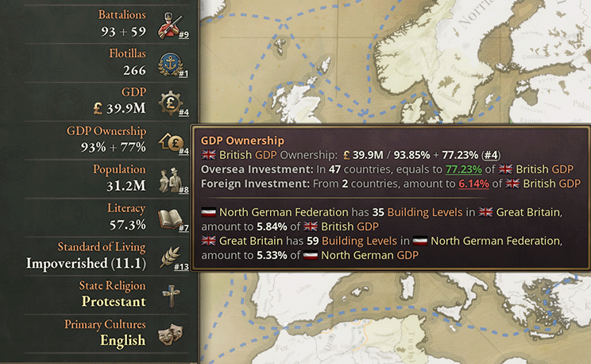
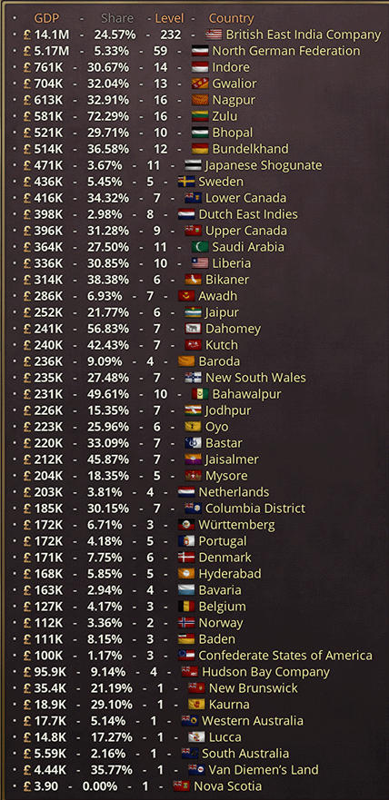

# GDP Ownership Display

中文版简介请见[此处](README.zh.md)

## Features

- Quickly find GDP Ownership of any country from the country panel
- Highlight for building levels owned by/of your country
- Display percentages of GDP both at home and abroad
- Sorted list of ownership details in the tootip of the ownership ratios

## Supported languages

- Simplified Chinese
- English

## My other mods & tools

- Paradox Bug Fix - A simple mod to solve tons of Paradox mistakes
  - Get it on [Steam](https://steamcommunity.com/sharedfiles/filedetails/?id=3277665729) or [GitHub](https://github.com/dragon-archer/vic3-mods/tree/main/Paradox%20Bug%20Fix)
- Paradox Highlight - A VS Code extension that provides syntax highlight for Paradox Games
  - Get it on [GitHub](https://github.com/dragon-archer/paradox-highlight) or [Visual Studio Marketplace](https://marketplace.visualstudio.com/items?itemName=dragon-archer.paradox-highlight)
