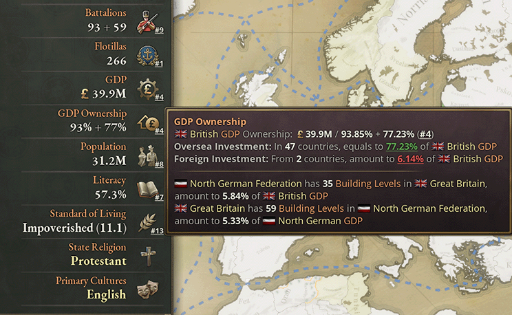
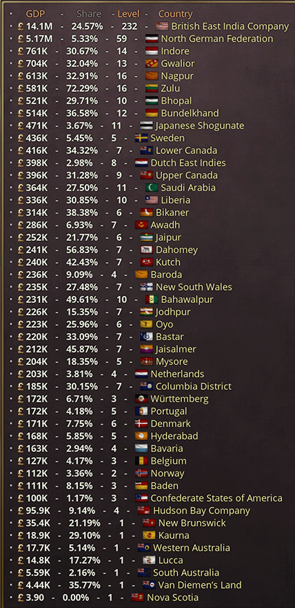

<h1 align="center">GDP所有权显示</h1>

	
	
	
	

<a href="README.md">English</a> | 中文

## 功能

- 在国家面板快速显示所有国家的所有权比例
- 突出显示你的国家所持有/被持有的建筑等级
- 分别显示海内外GDP所有权占比
- 悬浮在GDP占比数值可显示按拥有GDP数额降序排序的完整所有权清单

## 支持的语言

- 简体中文
- 英语
- 日语（感谢[@総帥閣下](https://steamcommunity.com/id/uwazumi)）
- 波兰语（感谢[@WarpWhistle79](https://steamcommunity.com/profiles/76561198409313440)）
- 其它语言也可使用此模组，但相关页面将仍然用英语显示
- 欢迎为本模组贡献其它语言的翻译！

## 支持本模组

如果您喜欢此模组，您可以直接在Steam平台上给一个肯定的评分，或者您也可以给本模组的[GitHub仓库](https://github.com/dragon-archer/vic3-mods.git)加一个星标（需要拥有GitHub账户）

## 我的其它模组和工具

- P社Bug修复 - 一个修复了大量P社bug和中文翻译错误的模组
  - 可从 [Steam](https://steamcommunity.com/sharedfiles/filedetails/?id=3277665729) 或 [GitHub](https://github.com/dragon-archer/vic3-mods/tree/main/Paradox%20Bug%20Fix) 获取
- Paradox Highlight - 一个为P社脚本提供语法高亮的VSCode插件
  - 可从 [GitHub](https://github.com/dragon-archer/paradox-highlight) 或 [Visual Studio Marketplace](https://marketplace.visualstudio.com/items?itemName=dragon-archer.paradox-highlight) 获取，也可访问 [Paradox Forum](https://forum.paradoxplaza.com/forum/threads/modding-tool-paradox-highlight-a-vscode-extension-for-highlighting-paradox-scripts.1686066/) 获取更多信息
